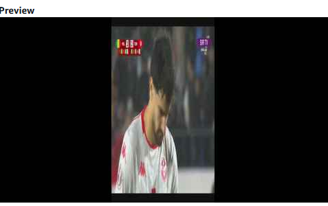
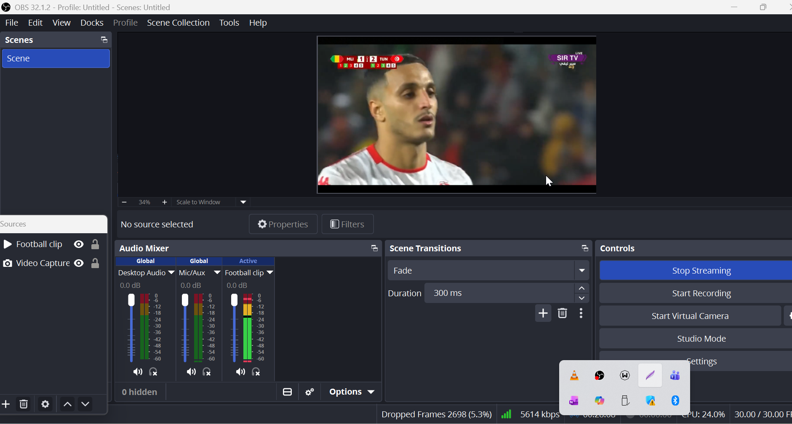
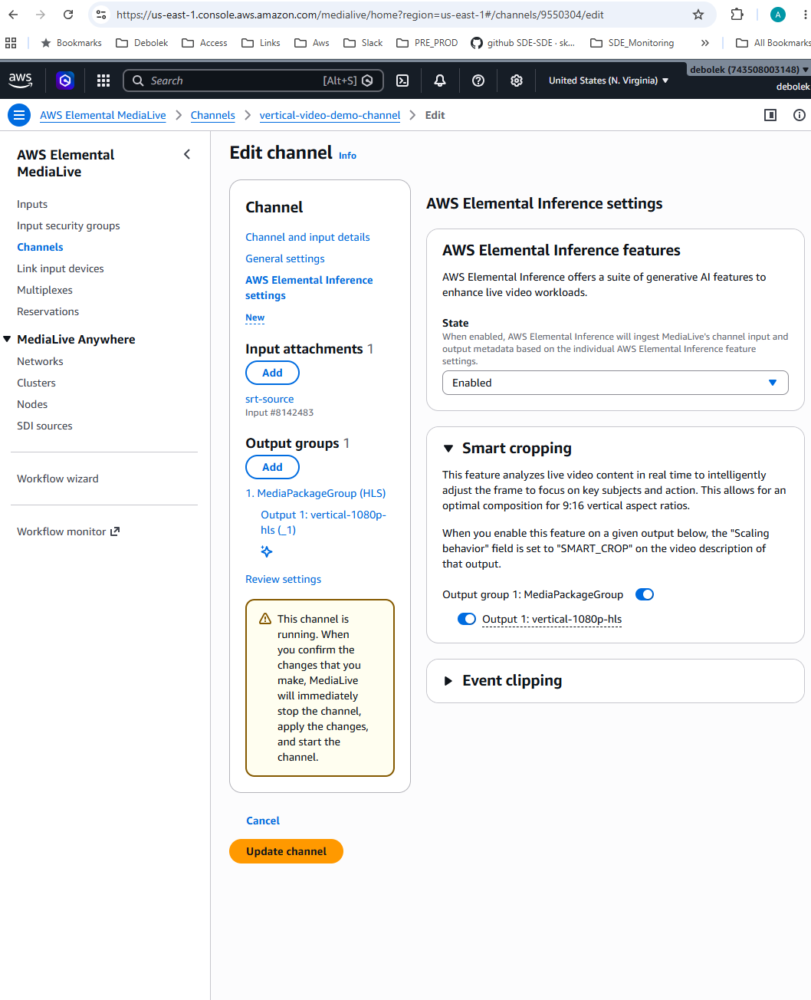
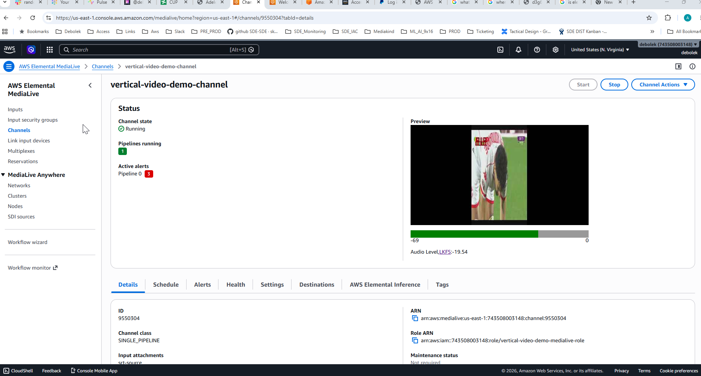
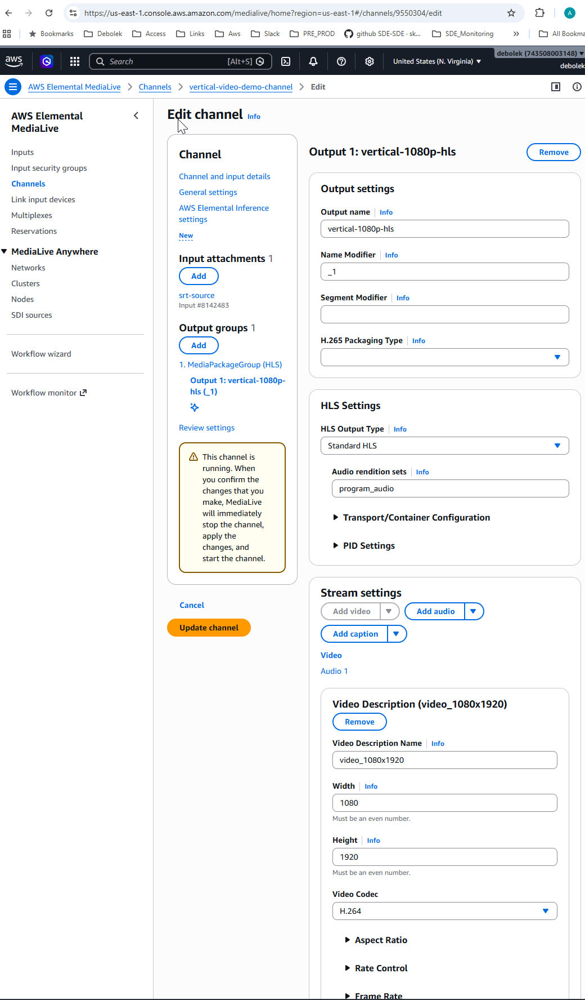
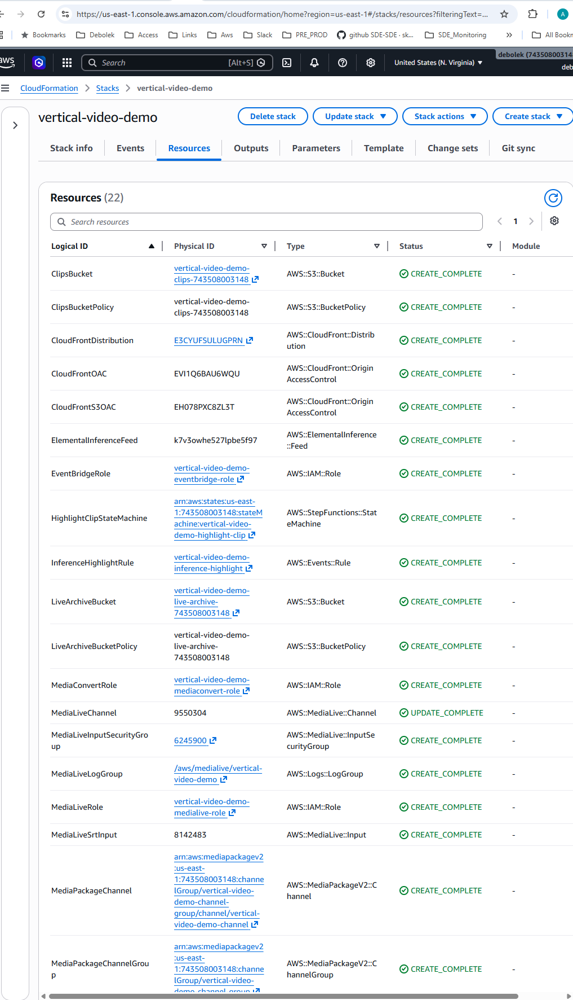
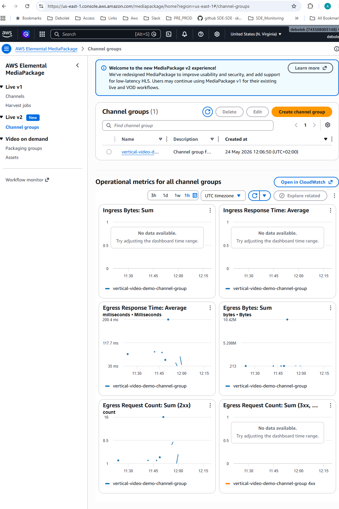

# AWS Elemental Inference – AI-Powered Vertical Video (9:16) Workflow

> Real-time 16:9 to 9:16 live stream conversion with AI smart cropping, powered by AWS Elemental Inference. Built for social media delivery (TikTok, Instagram Reels, YouTube Shorts) from a standard widescreen broadcast source.

---

## Background

The requirement came from a need to take a standard 16:9 widescreen broadcast (e.g. a live sport channel) and automatically generate a 9:16 vertical version for social platforms like TikTok — in real time, without manual intervention.

The key challenge for sport content is that a simple centre-crop doesn't work. The action moves — the ball, the players, the key moments. AWS Elemental Inference solves this by analysing the video stream continuously and dynamically determining the best crop region to keep the subject in frame.

This is the same approach used by DAZN for live football on TikTok.

---

## Architecture Overview

```
  Your Laptop                    AWS Cloud (us-east-1)
┌──────────────┐    ┌──────────────────────────────────────────────────────────────┐
│              │    │                                                              │
│ OBS Studio   │    │      ┌─────────────────────────────────────────┐            │
│ (Encoder)    │    │      │   AWS Elemental Inference               │            │
│              │    │      │  ┌──────────┐ ┌──────────┐ ┌─────────┐ │            │
│ 16:9 source  │    │  ②──▶│  │ Analysis │▶│Reasoning │▶│Smart    │ │            │
│ (football    │    │      │  │          │ │          │ │Crop     │ │            │
│  clip loop)  │    │      │  └──────────┘ └──────────┘ └─────────┘ │            │
│              │    │      │                    │ Highlight Clips ⑥  │            │
│ 1920x1080    │    │      │                    └──────────────────┐ │            │
│ 30fps        │    │      └──────────────────────────────────────┐│ │            │
│ 6 Mbps CBR   │    │                   ③ crop coords             ││ │            │
│ H.264 High   │    │  ┌───────────┐◀──────────────────────────────┘│ │            │
└──────┬───────┘    │  │  AWS      │①                               │ │            │
       │            │  │ Elemental │                                │ │            │
       │ RTMP Push  │  │ MediaLive │                                │ │            │
       │ :1935      │  │           │                                │ │            │
       └────────────┼─▶│ Input  ④  │                                │ │            │
                    │  │ Encoding  │                                │ │            │
                    │  └─────┬─────┘                                │ │            │
                    │        │ 1080x1920 (9:16)                     │ │            │
                    │        │                                      │ │            │
                    │   ┌────┴──────────────────────────────────┐   │ │            │
                    │   │         Output destinations           │   │ │            │
                    │   ├───────────────────────────────────────┤   │ │            │
                    │   │ HLS → MediaPackage v2  ⑤              │   │ │            │
                    │   │ RTMP → TikTok LIVE                    │   │ │            │
                    │   │ RTMP → YouTube Shorts                 │   │ │            │
                    │   │ RTMP → Instagram Reels                │   │ │            │
                    │   │ RTMP → Facebook LIVE                  │   │ │            │
                    │   └────┬──────────────────────────────────┘   │ │            │
                    │        │                                      │ │            │
                    │        ▼ HLS                  ⑥ EventBridge ◀─┘ │            │
                    │  ┌───────────┐                     │            │            │
                    │  │MediaPackage│                    ▼            │            │
                    │  │  v2 (JITP) │           ┌──────────────────┐  │            │
                    │  └─────┬─────┘           │  Lambda          │⑦ │            │
                    │        │                 │  (time-shifted   │  │            │
                    │        │                 │   clip fetch)    │  │            │
                    │        │                 └────────┬─────────┘  │            │
                    │        │                          │            │            │
                    │        │                 ┌────────▼─────────┐  │            │
                    │        │                 │    Amazon S3     │  │            │
                    │        │                 │  (clips bucket + │  │            │
                    │        │                 │   live archive)  │  │            │
                    │        │                 └────────┬─────────┘  │            │
                    │        │                          │            │            │
                    │        │                 ┌────────▼─────────┐  │            │
                    │        │                 │   SNS (notify)   │  │            │
                    │        │                 └─────────────────-┘  │            │
                    │        ▼                          ▼            │            │
                    │  ┌──────────────────────────────────────────┐  │            │
                    │  │       Amazon CloudFront  ⑨               │  │            │
                    │  │  Live: MediaPackage  │  VOD clips: S3    │  │            │
                    │  └──────────────────────────────────────────┘  │            │
                    │                     │                           │            │
                    └─────────────────────┼───────────────────────────┘            │
                                          │                                         │
              ┌───────────────────────────┼──────────────────────────────┐          │
              ▼                           ▼                              ▼          │
        📱 TikTok                  📱 Phone/Browser             📺 YouTube/IG/FB
       (RTMP LIVE)               (HLS via CloudFront)           (RTMP LIVE)
```

---

## Step-by-Step Flow

### Live Path (real-time vertical stream)

| Step | Service | What happens |
|------|---------|--------------|
| ① | MediaLive | Receives the incoming live video stream and sends it to Elemental Inference |
| ② | Elemental Inference | Analyses the video for smart cropping — detects subjects (players, ball, action) |
| ③ | Elemental Inference → MediaLive | Returns the desired crop coordinates back to the MediaLive channel in real time |
| ④ | MediaLive | Uses the crop coordinates to encode a vertical 9:16 (1080x1920) version of the input and simultaneously outputs to multiple destinations |
| ⑤ | MediaPackage v2 | Acts as the just-in-time packager (JITP) — packages the stream as HLS and serves as the live origin |
| ⑤ | TikTok/YouTube/Instagram/Facebook | Receives RTMP push directly from MediaLive — appears live on social platforms |
| ⑨ | CloudFront | CDN distributes the HLS stream globally over HTTPS to viewers on smartphones / browsers |

### Highlight Clip Path (async VOD)

| Step | Service | What happens |
|------|---------|--------------|
| ⑥ | Elemental Inference → EventBridge | Inference detects key moments (goals, tackles, celebrations) and fires a `Clip Metadata Generated` event |
| ⑦ | Lambda | Fetches the highlight segment using MediaPackage v2 time-shifted playback, downloads segments, builds a VOD HLS manifest, saves to S3 |
| | SNS | Sends a notification with clip details (event type, duration, S3 location) |
| ⑨ | CloudFront | Serves VOD clips from S3 under the `/clips/*` path |

---

## Infrastructure Components

| Resource | Purpose |
|----------|---------|
| `AWS::MediaLive::Input` | RTMP push input — OBS streams into MediaLive |
| `AWS::MediaLive::InputSecurityGroup` | Whitelist for encoder source IPs |
| `AWS::MediaLive::Channel` | Core encoder: 16:9 in → 1080x1920 (9:16) out, H.264 SMART_CROP via Elemental Inference |
| `AWS::ElementalInference::Feed` | AI feed for smart cropping and highlight detection |
| `AWS::MediaPackageV2::ChannelGroup` | Logical grouping for MediaPackage channels |
| `AWS::MediaPackageV2::Channel` | Receives HLS output from MediaLive |
| `AWS::MediaPackageV2::OriginEndpoint` | HLS endpoint — 6s segments, 60s DVR window, 900s startover (time-shifted playback) |
| `AWS::MediaPackageV2::OriginEndpointPolicy` | Allows CloudFront/public access to the endpoint |
| `AWS::Lambda::Function` | Clip processor — fetches highlights via time-shifted playback, saves to S3 |
| `AWS::Events::Rule` | EventBridge rule — triggers Lambda on `Clip Metadata Generated` events |
| `AWS::SNS::Topic` | Notifications when highlight clips are saved |
| `AWS::S3::Bucket` | Two buckets: **live-archive** (7-day retention) and **clips** (30-day retention) |
| `AWS::CloudFront::Distribution` | CDN — live origin (MediaPackage) + VOD clips (S3) |
| `AWS::IAM::Role` × 3 | Least-privilege roles (MediaLive, MediaPackage, Lambda) |
| `AWS::Logs::LogGroup` | MediaLive channel logs (7-day retention) |

---

## Video Encode Specification

| Parameter | Value |
|-----------|-------|
| Input format | 16:9 (any resolution) |
| Output resolution | 1080 × 1920 (9:16 portrait) |
| Aspect ratio | 9:16 |
| Codec | H.264 (AVC) High Profile, Level 4.1 |
| Rate control | CBR or VBR |
| Target bitrate | 4500-6000 kbps (adaptive streaming) |
| Max bitrate | 8000 kbps |
| Frame rate | 30 fps (or 60 fps) |
| Keyframe interval | 2 seconds |
| GOP size | 60 frames (2 seconds @ 30fps) |
| Profile | High |
| Audio codec | AAC |
| Audio bitrate | 128-192 kbps |
| Pixel format | yuv420p |
| Color space | Rec. 709 |
| HLS segment duration | 2 seconds (low latency) |

---

## Prerequisites

- AWS CLI configured with credentials for your account
- Sufficient service limits in `us-east-1` for MediaLive, MediaPackage v2, and Elemental Inference
- Elemental Inference enabled/activated in your account (verify in the AWS console before deploying)

---

## Deployment

### Get your social media stream keys (optional)

To push directly to social platforms, you need stream keys from each platform:

#### TikTok LIVE
1. Open TikTok app → Go Live → select "Live Studio" or "Third-party tools"
2. Copy the **Server URL** and **Stream Key**
3. Use only the stream key (the part after the last `/`)

#### YouTube LIVE
1. Go to [YouTube Studio](https://studio.youtube.com) → Go Live
2. Under "Stream settings" copy the **Stream key**

#### Instagram LIVE
1. Go to [Meta Creator Studio](https://business.facebook.com/creatorstudio)
2. Select Instagram account → Go Live → Use streaming software
3. Copy the **Stream key**

#### Facebook LIVE
1. Go to [Meta Creator Studio](https://business.facebook.com/creatorstudio)
2. Select Facebook page → Go Live → Use streaming software
3. Copy the **Stream key**

### Deploy the stack

**Without social media (HLS only):**
```bash
aws cloudformation deploy \
  --template-file medialive-vertical.yaml \
  --stack-name vertical-video-demo \
  --capabilities CAPABILITY_NAMED_IAM \
  --region us-east-1
```

**With TikTok + YouTube:**
```bash
aws cloudformation deploy \
  --template-file medialive-vertical.yaml \
  --stack-name vertical-video-demo \
  --capabilities CAPABILITY_NAMED_IAM \
  --region us-east-1 \
  --parameter-overrides \
    TikTokStreamKey="YOUR_TIKTOK_STREAM_KEY" \
    YouTubeStreamKey="YOUR_YOUTUBE_STREAM_KEY"
```

**With all platforms:**
```bash
aws cloudformation deploy \
  --template-file medialive-vertical.yaml \
  --stack-name vertical-video-demo \
  --capabilities CAPABILITY_NAMED_IAM \
  --region us-east-1 \
  --parameter-overrides \
    TikTokStreamKey="YOUR_TIKTOK_STREAM_KEY" \
    YouTubeStreamKey="YOUR_YOUTUBE_STREAM_KEY" \
    InstagramStreamKey="YOUR_INSTAGRAM_STREAM_KEY" \
    FacebookStreamKey="YOUR_FACEBOOK_STREAM_KEY"
```

**Check which platforms are enabled:**
```bash
aws cloudformation describe-stacks \
  --stack-name vertical-video-demo \
  --region us-east-1 \
  --query "Stacks[0].Outputs[?OutputKey=='SocialDeliverySummary'].OutputValue" \
  --output text
```

### Get the CloudFront playback URL

```bash
aws cloudformation describe-stacks \
  --stack-name vertical-video-demo \
  --region us-east-1 \
  --query "Stacks[0].Outputs[?OutputKey=='HlsPlaybackUrl'].OutputValue" \
  --output text
```

### Get the SRT input endpoint (to configure your encoder)

```bash
# Get the SRT input ID from the stack output
INPUT_ID=$(aws cloudformation describe-stacks \
  --stack-name vertical-video-demo \
  --region us-east-1 \
  --query "Stacks[0].Outputs[?OutputKey=='MediaLiveSrtInputId'].OutputValue" \
  --output text)

# Describe the input to get the SRT endpoint URL
aws medialive describe-input \
  --input-id $INPUT_ID \
  --region us-east-1 \
  --query "Destinations"
```

### Start the MediaLive channel (only when ready to stream)

```bash
CHANNEL_ID=$(aws cloudformation describe-stacks \
  --stack-name vertical-video-demo \
  --region us-east-1 \
  --query "Stacks[0].Outputs[?OutputKey=='MediaLiveChannelId'].OutputValue" \
  --output text)

aws medialive start-channel \
  --channel-id $CHANNEL_ID \
  --region us-east-1
```

### Stop the channel (to avoid costs when not in use)

```bash
aws medialive stop-channel \
  --channel-id $CHANNEL_ID \
  --region us-east-1
```

---

## Tear Down

When the demo is complete, delete the entire stack to avoid ongoing charges:

```bash
# Empty both S3 buckets first (CloudFormation cannot delete non-empty buckets)
ACCOUNT_ID=$(aws sts get-caller-identity --query Account --output text)

aws s3 rm s3://vertical-video-demo-clips-${ACCOUNT_ID} --recursive
aws s3 rm s3://vertical-video-demo-live-archive-${ACCOUNT_ID} --recursive

# Delete the stack
aws cloudformation delete-stack \
  --stack-name vertical-video-demo \
  --region us-east-1
```

---

## Cost Considerations

> ⚠️ **MediaLive is the most expensive component.** Only start the channel when actively streaming. The stack can remain deployed with the channel in IDLE state at minimal cost.

| Service | Billing model |
|---------|--------------|
| MediaLive | Per running hour (SINGLE_PIPELINE HD ~$0.87/hr) |
| Elemental Inference | Per hour of analysed video |
| MediaPackage v2 | Per GB of video originated |
| MediaConvert | Per minute of output video |
| S3 | Per GB stored + requests (2 buckets: live archive + clips) |
| CloudFront | Per GB transferred |

**Recommended approach for demos:** deploy the stack in advance, start the channel only when presenting, stop it immediately after. Use CloudFormation to wipe everything when the project is complete.

---

## Connecting OBS Studio

### 1. Install OBS Studio

Download and install from [obsproject.com](https://obsproject.com) (free, open source, works on Windows/Mac/Linux).

### 2. Get your RTMP endpoint from AWS

After deploying the stack, get the MediaLive RTMP input URL:

> ⚠️ **The RTMP IP address changes every time you redeploy the stack.** Always run this command after a fresh deploy.

```powershell
aws medialive list-inputs `
  --region us-east-1 `
  --query "Inputs[?Name=='vertical-video-demo-rtmp-input'].[Id,Destinations[0].Url]" `
  --output table
```

You'll get something like: `rtmp://x.x.x.x:1935/vertical-video-demo`

### 3. Configure OBS Studio — Step by Step

#### A. Video Settings

**Settings → Video:**

| Setting | Value |
|---------|-------|
| Base (Canvas) Resolution | **1920x1080** |
| Output (Scaled) Resolution | **1080x1920** (type manually if not in dropdown) |
| Downscale Filter | **Lanczos** |
| Common FPS Values | **30** |

Click **Apply**

> After this change, the OBS preview will become a tall vertical rectangle — that's correct, it's the 9:16 output format.

#### B. Output Settings

**Settings → Output:**

| Setting | Value |
|---------|-------|
| Output Mode | **Advanced** |

Then click the **Streaming** tab:

| Setting | Value |
|---------|-------|
| Encoder | **x264** |
| Rate Control | **CBR** |
| Bitrate | **6000** Kbps |
| Keyframe Interval | **2** seconds |
| CPU Usage Preset | **veryfast** |
| Profile | **high** |
| Tune | **(none)** |

Click **Apply**

#### C. Audio Settings

**Settings → Audio:**

| Setting | Value |
|---------|-------|
| Sample Rate | **48 kHz** |
| Channels | **Stereo** |

Click **Apply**

#### D. Stream Settings (RTMP)

**Settings → Stream:**

| Setting | Value |
|---------|-------|
| Service | **Custom** |
| Server | `rtmp://YOUR_IP:1935/vertical-video-demo` (from step 2) |
| Stream Key | `stream` |

Click **Apply** → **OK**

#### E. Add a video source (football clip)

1. In the **Sources** panel at the bottom, click **+**
2. Select **Media Source**
3. Name it `Football clip` → click **OK**
4. Click **Browse** → select a football match video file (MP4, any 16:9 clip)
5. Check these options:
   - ✅ **Loop**
   - ✅ **Restart playback when source becomes active**
   - ✅ **Use hardware decoding when available**
   - ❌ Show nothing when playback ends (uncheck)
   - ❌ Close file when inactive (uncheck)
6. Click **OK**

#### F. Fit the video to the canvas

1. Right-click on the **Football clip** source in the Sources panel
2. Click **Transform → Fit to screen**

The video should now fill the entire vertical preview area.

### 4. Start streaming

1. **Start the MediaLive channel first:**
   ```powershell
   $CHANNEL_ID = $(aws cloudformation describe-stacks `
     --stack-name vertical-video-demo `
     --region us-east-1 `
     --query "Stacks[0].Outputs[?OutputKey=='MediaLiveChannelId'].OutputValue" `
     --output text)

   aws medialive start-channel --channel-id $CHANNEL_ID --region us-east-1
   ```
2. Wait 60 seconds for the channel to reach RUNNING state
3. In OBS, click **Start Streaming**
4. You should see at the bottom of OBS:
   - Green circle
   - "LIVE" indicator
   - Bitrate showing ~6000 kb/s

### 5. View the vertical output

The `deploy.ps1` script gives you the full playback URL. Open it in:
- **VLC Media Player** (Media → Open Network Stream → paste URL)
- **Safari on iPhone** (paste URL in browser — plays natively)
- **Online HLS player** at [hlsplayer.net](https://www.hlsplayer.net)

Wait 10-15 seconds after OBS starts streaming before the playback URL will work.

### 6. Stop streaming (to avoid costs)

1. In OBS, click **Stop Streaming**
2. Stop the MediaLive channel:
   ```powershell
   aws medialive stop-channel --channel-id $CHANNEL_ID --region us-east-1
   ```

---

## Troubleshooting OBS

| Issue | Solution |
|-------|----------|
| OBS says "Connecting..." forever | Check that MediaLive channel is RUNNING, not IDLE |
| "Connection failed" | Verify the RTMP URL is correct — IP changes on each deploy |
| High CPU usage | Lower the CPU preset to "ultrafast" or reduce bitrate to 4500 Kbps |
| Stream is choppy | Check your upload bandwidth — you need at least 8 Mbps upload speed |
| No video in CloudFront | Wait 60-90 seconds after starting OBS — MediaPackage needs time to buffer segments |
| Preview is black | Click the video source, then Transform → Fit to screen |
| "Primary playlist not found" | OBS is not streaming yet — click Start Streaming first |

---

## Quick Deploy Checklist

After deploying the CloudFormation stack, run the automated setup script:

```powershell
.\deploy.ps1
```

This script automatically:
1. Checks AWS credentials
2. Gets the RTMP URL for OBS
3. Fixes the CloudFront origin domain
4. Applies the MediaPackage endpoint policy
5. Prints your OBS settings and playback URL

Then manually:
1. Start the MediaLive channel (command shown by the script)
2. Update OBS Server URL if it changed
3. Click Start Streaming in OBS
4. Open the playback URL on your phone

---

## Demo Results

### AI Smart Crop — 9:16 Vertical Output
The Elemental Inference AI automatically crops the 16:9 football match to follow the action in 9:16 portrait format:



### OBS Studio Streaming Live
Football clip streaming from OBS to AWS MediaLive via RTMP:



### AWS Elemental Inference — Smart Crop Enabled
AI-powered smart cropping enabled on the MediaLive channel:



### MediaLive Channel Running
Channel running with 9:16 vertical preview visible:



### Video Output — 1080x1920 (9:16)
Encoder configured for 1080 width × 1920 height vertical output:



### CloudFormation Stack — All Resources Created
22 resources deployed successfully via Infrastructure as Code:



### MediaPackage v2 — HLS Endpoint
Live v2 channel group with operational metrics showing video flow:



---

## References

- [AWS NAB 2026 Demo Guide – Elemental Inference Architecture (p.38)](https://d2mee59kmfnfxw.cloudfront.net/nab2026/images/AWS-NAB-2026-Demo-Guide.pdf)
- [AWS Elemental MediaLive documentation](https://docs.aws.amazon.com/medialive/)
- [AWS Elemental MediaPackage v2 documentation](https://docs.aws.amazon.com/mediapackage/)
- [AWS Elemental Inference](https://aws.amazon.com/elemental-inference/)
- [Amazon CloudFront documentation](https://docs.aws.amazon.com/cloudfront/)
